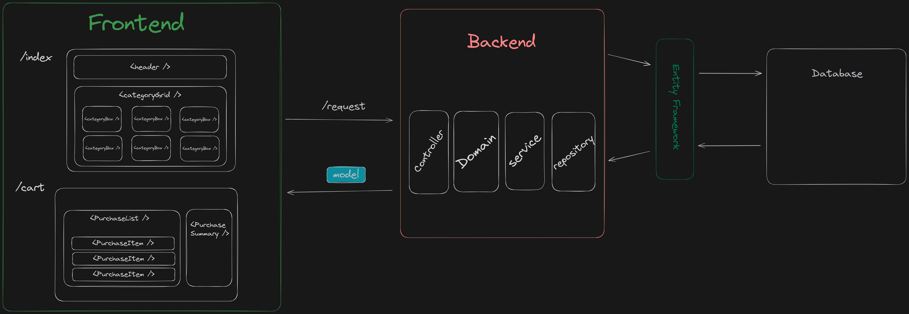

# SmartTrade
Plataforma de comercio sostenible alineado con las ODS.

## Development
Requisitos:
- [.NET Core 7.0](https://dotnet.microsoft.com/en-us/download/dotnet/7.0)
- [Node.js & npm](https://nodejs.org/en/download)
- [Docker & docker-compose](https://www.docker.com/products/docker-desktop/)

### Inicializar
#### Frontend
```bash
cd Frontend
npm i
npm run build:css
npm run watch:css
dotnet run
```
Listen on http://localhost:5173

#### Backend
```bash
docker-compose up -d database
cd Backend
dotnet tool install --global dotnet-ef --version 7.0.16
dotnet ef database update
dotnet run
```

Listen on http://localhost:5218

Swagger on http://localhost:5218/swagger

### Detalles
#### Tecnologías
El proyecto se divide en un Frontend hecho en [Blazor wasm](https://dotnet.microsoft.com/en-us/apps/aspnet/web-apps/blazor) basado en C# permitiendo crear interfaces de usuario web sin necesidad de usar Javascript para dotarlas de funcionalidad.
Para el control del estado de las interfaces utilizaremos el manejador de estados [Fluxor](https://github.com/mrpmorris/Fluxor).
Y como libreria de componentes de interfaz de usuario usaremos la biblioteca de [Flowbite](https://flowbite.com/)

Este cliente se nutre de la información que le provee el Backend, que se trata de una API REST hecha con el framework [ASP .NET Core](https://dotnet.microsoft.com/en-us/apps/aspnet). Para el control de la persistencia y la comunicacion con el motor de base de datos haremos uso de [Entity Framework](https://learn.microsoft.com/en-us/ef/) junto a [LINQ](https://learn.microsoft.com/en-us/dotnet/csharp/linq/) a modo de ORM para simplificar las consultas, tambien nos permitirá abstraernos de las migraciones en BD creando las relaciones en funcion de nuestro modelo haciendo uso del Models as Code ofreciendonos más flexibilidad a la hora de cambiar nuestro modelo agilizando el desarrollo.

Como persistencia hemos optado por el motor de base de datos [PostgreSQL](https://www.postgresql.org/)

#### Arquitectura
##### Frontend
Seguiremos el patrón de Micro Frontend, basandonos en la idea de descomponer nuestras pantallas en componentes lo más pequeños posibles. Facilitando la separación de logicas entre componentes y la reutilización de los mismos.
El sistema de diseño lo basaremos en las opciones que nos ofrece la biblioteca Flowbite.
Y para comunicar a nuestros componentes el estado global sin importar el punto en el que se encuentren en el arbol de composición de la interfaz, como por ejemplo el rol de usuario. De tal forma podemos hacer interfaces adaptables.

###### Backend
Haciendo uso de una arquitectura en capas conformadas por:
- Controlador
- Dominio
- Servicio
- Repositorio

Controlador: Punto de entrada de la API se encarga de la comunicacion con el exterior, los códigos de respuesta http y de multiplexar las peticiones y devolver la respuesta correspondiente del dominio.

Dominio: Conforma nuestras clases de dominio siendo la cabeza de nuestra lógica de dominio, evitando generar dumb models, aunque una mejor opción sería generar Data Transfer Object, pero no es nuestro caso. Está capa está encargada de definir la lógica de dominio como podría ser la validación de datos. 

Servicio: Está a disposición de las clases de dominio para recoger las funcionalidades que no son puramente de dominio, como podría ser la composición de objetos para formar nuestras entidades satisfaciendo cualquier restricción del modelo.

Repositorio: Encargado de las modificaciones del estado del modelo en la BD, es la capa que comunica con EF.


